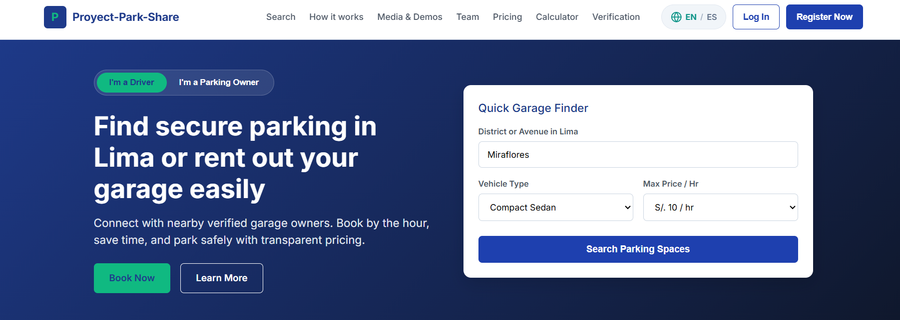
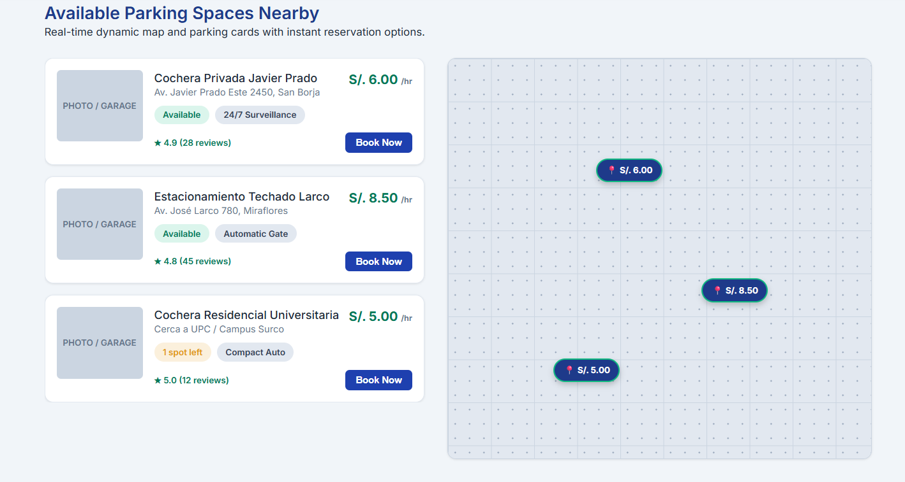
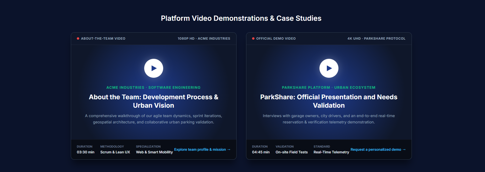
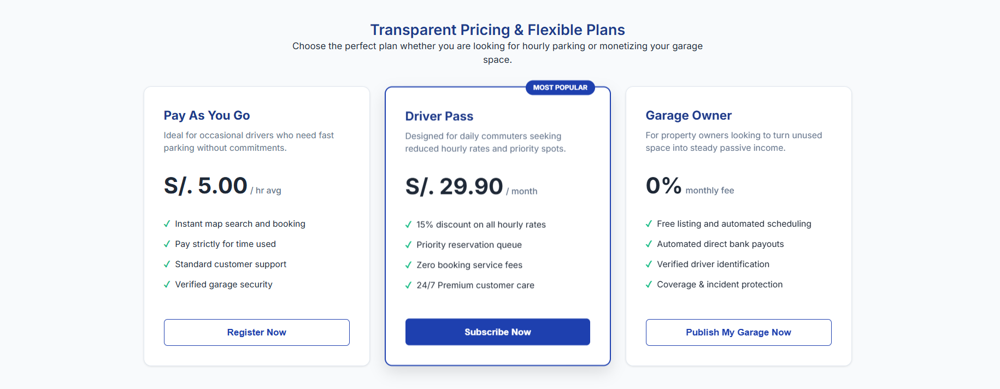
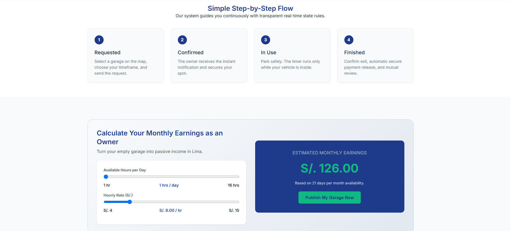
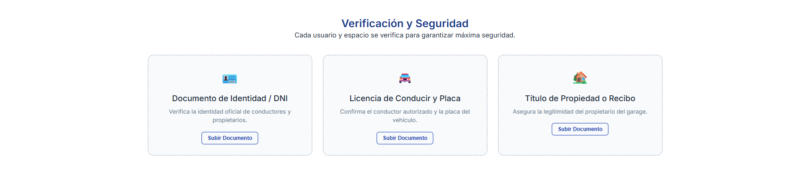
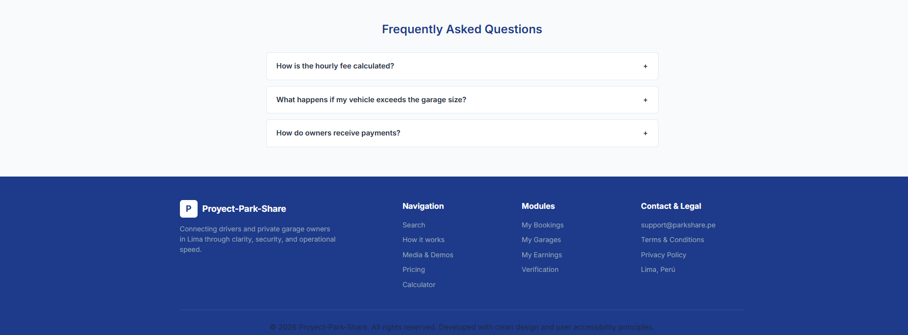

# Capítulo V: Product Implementation, Validation & Deployment

## 5.1 Software Configuration Management

La gestión del proyecto incluye el código fuente, documentación, prototipos y configuraciones del entorno de desarrollo de la plataforma web de localización y reserva de estacionamientos. El proyecto contempla distintos productos digitales, incluyendo una Landing Page institucional, una aplicación web interactiva de tipo marketplace para conductores y propietarios de cocheras, y servicios backend orientados al procesamiento en tiempo real de ubicaciones, disponibilidad y gestión de reservas. El equipo adopta prácticas basadas en GitFlow, Conventional Commits y Semantic Versioning, asegurando un flujo de trabajo colaborativo y organizado.

### 5.1.1. Software Development Environment Configuration

| Categoría / Actividad   | Nombre del Producto       | Propósito de Uso en el Proyecto                                                                                                                                                                     | Tipo / Plataforma      | Ruta de Referencia / Descarga               |
| ----------------------- | ------------------------- | --------------------------------------------------------------------------------------------------------------------------------------------------------------------------------------------------- | ---------------------- | ------------------------------------------- |
| Project Management      | Trello                    | Gestión e itinerario de tareas del proyecto mediante tableros organizados por estados (To-Do, In Progress, Done), clave para el seguimiento de entregables como el reporte y la landing page.       | SaaS                   | https://trello.com                          |
| Team Communication      | Discord                   | Plataforma principal de comunicación remota para la realización de reuniones de equipo sincrónicas, planificación de Sprints y coordinación general.                                                | SaaS / Desktop         | https://discord.com/                        |
| Requirements Management | Miro                      | Estructuración de ideas, diagramación de flujos de sistema, análisis del negocio y ejecución de la sesión de Event Storming para el ecosistema IoT.                                                 | SaaS                   | https://miro.com                            |
| Requirements Management | Structurizr               | Modelado de la arquitectura de software del sistema ParkShare bajo el modelo C4, representando los componentes clave (dashboard, gateway, nodos IoT y servicios de monitoreo).                      | SaaS / Desktop         | https://structurizr.com                     |
| Product UX/UI Design    | Figma                     | Diseño visual y prototipado interactivo de las interfaces del sistema, incluyendo el dashboard centralizado, paneles de control de dispositivos y visualización de consumo energético.              | SaaS / Desktop         | https://www.figma.com                       |
| Product UX/UI Design    | Lucidchart                | Elaboración de diagramas de flujo de trabajo, arquitectura técnica y diseño de procesos operativos del sistema.                                                                                     | SaaS                   | https://www.lucidchart.com                  |
| Software Development    | HTML5 / CSS3 / JavaScript | Lenguajes y estándares base utilizados para el desarrollo del frontend web, las interfaces de usuario y la Landing Page del producto.                                                               | Lenguajes / Estándares | https://developer.mozilla.org/es/docs/Web   |
| Software Development    | WebStorm                  | Entorno de desarrollo integrado (IDE) principal utilizado para la programación, edición y depuración del código fuente del frontend.                                                                | Desktop                | https://www.jetbrains.com/webstorm/download |
| Software Testing        | Gherkin                   | Lenguaje de especificación para definir escenarios de prueba BDD (Behavior-Driven Development) basados en historias de usuario (control remoto, automatizaciones por horario y alertas de consumo). | Estándar / DSL         | https://cucumber.io/docs/gherkin/reference  |
| Software Documentation  | GitHub                    | Repositorio central del proyecto para el control de versiones distribuido, registro de commits, trabajo colaborativo y alojamiento de la documentación del sistema.                                 | SaaS                   | https://github.com                          |
| Software Deployment     | GitHub Pages              | Servicio de alojamiento y despliegue continuo para la Landing Page pública del producto, permitiendo exponer la propuesta de valor de ParkShare.                                                    | SaaS                   | https://pages.github.com                    |

### 5.1.2. Source Code Management

Para la gestión del código fuente y de los artefactos asociados al proyecto ParkShare, el equipo utiliza Git como sistema de control de versiones distribuido y GitHub como plataforma central para el almacenamiento de repositorios, seguimiento de cambios y coordinación del trabajo colaborativo.

El proyecto se encuentra organizado dentro de la organización de GitHub **1ASI0729-7793-ParkShare**, donde se mantienen repositorios independientes para la documentación del proyecto, la Landing Page y la aplicación web.

Los principales repositorios utilizados son los siguientes:

| Repositorio            | Propósito                                                                                                             | Enlace                                                            |
| ---------------------- | --------------------------------------------------------------------------------------------------------------------- | ----------------------------------------------------------------- |
| Proyect-Park-Share     | Almacena el informe académico, documentación, assets, diagramas, wireframes, mockups y demás artefactos del proyecto. | https://github.com/1ASI0729-7793-ParkShare/Proyect-Park-Share     |
| landing-page-ParkShare | Contiene el código fuente correspondiente a la Landing Page de ParkShare.                                             | https://github.com/1ASI0729-7793-ParkShare/landing-page-ParkShare |
| ParkShare-frotend      | Contiene el código fuente de la aplicación web principal desarrollada con Angular.                                    | https://github.com/1ASI0729-7793-ParkShare/ParkShare-frotend      |

El equipo utiliza una estrategia de branching basada en una adaptación de **GitFlow**, con una rama principal estable, una rama de integración y ramas temporales para el desarrollo de funcionalidades específicas.

La estructura general seguida es la siguiente:

```text
main
  │
  └── develop
       ├── feature/*
       ├── docs/*
       └── otras ramas de trabajo
```

### 5.1.3. Source Code Style Guide and Conventions

Con el propósito de asegurar la legibilidad, mantenibilidad y coherencia arquitectónica en el código fuente del frontend de ParkShare, el equipo de ACME Industries establece un conjunto de directrices normativas de estilo. Estas convenciones garantizan un desarrollo modular, reducen la deuda técnica y facilitan el trabajo colaborativo entre los integrantes del equipo durante el desarrollo de la Landing Page y la Web Application.

Directrices para el Frontend (Angular / TypeScript)
El desarrollo del cliente web se fundamenta en las guías oficiales de estilo de Angular y las mejores prácticas del lenguaje TypeScript.

**Nomenclatura y Convenciones de Archivos:**

- Componentes, Servicios y Módulos: Nombres de archivo en sintaxis kebab-case acompañados de su tipo explícito.

- Clases, Interfaces y Modelos: Redacción en PascalCase para la declaración de clases e interfaces de datos mock / modelos de interfaz.

- Variables y Métodos: Uso de camelCase para la declaración de propiedades, atributos y funciones.

- Constantes: Formato UPPER_SNAKE_CASE para valores inmutables o datos de prueba locales.

**Estructura y Arquitectura de la Aplicación Web:**

- Organización por Capas/Módulos: Distribución clara del código dividida en carpetas funcionales (components, services, models, guards, assets).

- Diseño Modular y Reutilización: Separación entre componentes de maquetación/UI (tarjetas de parqueos, filtros, encabezados) y servicios locales encargados de manejar el estado temporal de la interfaz.

**Estructura y Estilos Visuales (HTML / CSS):**

Uso de Flexbox y CSS Grid: Estructuración de pantallas adaptables (responsive) mediante grillas flexibles alineadas con las guías de diseño para dispositivos móviles y de escritorio.

**Calidad y Formateo de Código:**

Análisis Estático: Integración de ESLint con reglas de TypeScript (typescript-eslint) para asegurar el tipado explícito, evitar variables no utilizadas y mantener la limpieza en los componentes de Angular.

### 5.1.4. Software Deployment Configuration

En esta sección se detalla el procedimiento de configuración del entorno de despliegue para los productos digitales del proyecto ParkShare, describiendo los pasos técnicos requeridos para publicar el código fuente alojado en el repositorio oficial.

Para la presente entrega, la estrategia de distribución se apoya en la infraestructura de GitHub, utilizando el servicio GitHub Pages para la publicación y alojamiento del contenido web de la plataforma.

**Landing Page y Documentación del Proyecto**

La publicación pública de la Landing Page (desarrollada con el marco de trabajo Angular) y del informe técnico del proyecto se ejecuta a través de GitHub Pages, siguiendo el flujo operativo que se describe a continuación:

- Estructuración del Repositorio: Creación e inicialización del repositorio remoto bajo la organización oficial de la startup (ACME Industries).

- Compilación de Producción: Ejecución del comando de construcción en Angular para generar los artefactos finales optimizados de producción (archivos estáticos HTML, JavaScript y CSS) dentro del directorio objetivo (dist/ParkShare/browser o equivalente del proyecto).

- Gestión de Ramas de Despliegue: Configuración del flujo de publicación asociando la rama principal (main) o la rama especializada de distribución (gh-pages).

- Aprovisionamiento del Servicio: Activación y validación de la fuente de publicación desde la sección de ajustes (Settings > Pages) del repositorio en GitHub.

- Emisión de Dominio Público: Generación automática de la URL pública cifrada mediante protocolo HTTPS para el acceso al sitio.

## 5.2. Landing Page, Services & Applications Implementation

En esta seccion se va a describir el proceso de implementacion del Proyecto ParkShare, donde se incluira el desarrollo, documentacion y despliegue del Landing Page.

Para este avance se implemento la primera version del Landing Page. El desarrollo se realizo utilizando GitHub como herramienta de control de versiones.

### 5.2.1. Sprint 1

En esta seccion se presentara el avance del Sprint 1 en terminos de desarrollo del producto y el trabajo colaborativo del equipo.

Durante este sprint se realizo la implementacion de la primera version del Landing Page, que se enfocara en presenta la propuesta de valor del sistema.

Asimismo se incluiran evidencias relacionadas con la planificacion del sprint, la organizacion del equipo, el desarrollo realizado, asi como los resultados obtenidos y la colaboracion.

#### 5.2.1.1. Sprint Planning 1

En esta seccion se describen los principales acuerdos y definiciones realizadas durante el Sprint Planning del Sprint 1, donde nos enfocaremos en la implementacion del Landing Page.

| Campo                                | Detalle                                                                                                                                                                                                                                                                                                                                                                                                                                     |
| ------------------------------------ | ------------------------------------------------------------------------------------------------------------------------------------------------------------------------------------------------------------------------------------------------------------------------------------------------------------------------------------------------------------------------------------------------------------------------------------------- |
| **Sprint #**                         | Sprint 1                                                                                                                                                                                                                                                                                                                                                                                                                                    |
| **Sprint Planning Background**       |                                                                                                                                                                                                                                                                                                                                                                                                                                             |
| Date                                 | 2026-09-26                                                                                                                                                                                                                                                                                                                                                                                                                                  |
| Time                                 | 16:30                                                                                                                                                                                                                                                                                                                                                                                                                                       |
| Location                             | Reunión virtual (Discord)                                                                                                                                                                                                                                                                                                                                                                                                                   |
| Prepared By                          | Daril Johan Palomino Vilcañaupa                                                                                                                                                                                                                                                                                                                                                                                                             |
| Attendees (to planning meeting)      | Palomino Vilcañaupa, Daril Johan - Tello Palacios, Fabrizio Rafael - Checa Burga, Oscar Diego - Yanac Flores, Gabriel Stefano - Urviola Condori, Mateo Sebastian                                                                                                                                                                                                                                                                            |
| **Sprint 1 – Review Summary**        | En esta entrega se tomo encuenta el Product Backlog definido y los diseños web de la landing page.                                                                                                                                                                                                                                                                                                                                          |
| **Sprint 1 – Retrospective Summary** | Para esta entrega no se aplico. No obstante, el equipo se enfoco en la distribucion de tareas y comunicacion constante.                                                                                                                                                                                                                                                                                                                     |
| **Sprint Goal & User Stories**       |                                                                                                                                                                                                                                                                                                                                                                                                                                             |
| Sprint 1 Goal                        | Our goal is to build a fully functional and responsive landing page that clearly communicates ACME Industries' value proposition through its ParkShare solution. We believe this site will allow potential customers to accurately understand the product's benefits. We will confirm the success of this objective when users can view the platform, navigate smoothly between its main sections, and access it correctly from any device. |
| User Stories incluidas en el Sprint  | US31: Visualizar Landing Page; US32: Navegar entre secciones del Landing Page; US33: Visualización responsive del Landing Page                                                                                                                                                                                                                                                                                                              |
| **Sprint 1 speed of work**           | 9 Story Points                                                                                                                                                                                                                                                                                                                                                                                                                              |
| **The sum of history points**        | 9 Story Points                                                                                                                                                                                                                                                                                                                                                                                                                              |

---

| Campo                                   | Detalle                                                                                                                                                                                                                                                                                                                                                                                                                                                                                                                                              |
| :-------------------------------------- | :--------------------------------------------------------------------------------------------------------------------------------------------------------------------------------------------------------------------------------------------------------------------------------------------------------------------------------------------------------------------------------------------------------------------------------------------------------------------------------------------------------------------------------------------------- |
| **Sprint Goal & User Stories**          |                                                                                                                                                                                                                                                                                                                                                                                                                                                                                                                                                      |
| **Sprint 1 Goal**                       | Nuestro objetivo se enfoca en construir una Landing Page totalmente funcional y adaptativa que comunique con claridad la propuesta de valor de ParkShare para conductores y propietarios[cite: 173, 174]. Consideramos que esto permitirá a los visitantes comprender de forma precisa los beneficios del servicio[cite: 173, 174]. Confirmaremos el éxito de este objetivo cuando los usuarios puedan explorar el sitio público, interactuar sin fricciones entre sus secciones principales y acceder de manera óptima desde cualquier dispositivo. |
| **User Stories incluidas en el Sprint** | **US27**: Información para conductores en el Landing Page; **US28**: Información para propietarios en el Landing Page; **US29**: Información sobre funcionamiento y confianza; **US30**: Redirección desde el Landing Page a la Web Application.                                                                                                                                                                                                                                                                                                     |
| **Sprint 1 Velocity**                   | 8 Story Points                                                                                                                                                                                                                                                                                                                                                                                                                                                                                                                                       |
| **Sum of Story Points**                 | 8 Story Points                                                                                                                                                                                                                                                                                                                                                                                                                                                                                                                                       |

#### 5.2.1.2. Aspect Leaders and Collaborators

Para este primer sprint, los frentes de trabajo se enfocaron en la construcción integral de la Landing Page de ParkShare, abarcando la maquetación visual, el flujo de navegación entre módulos y la adaptabilidad para múltiples pantallas (responsive design).

A continuación, se presenta la distribución de roles según las responsabilidades asignadas en el sprint (L: Líder, C: Colaborador, A: Apoyo, X: Sin participación directa)

| Team Member (Last Name, First Name)  | GitHub Username | Estructura del Landing Page | Navegación entre secciones | Diseño Responsive |
| :----------------------------------- | :-------------- | :-------------------------: | :------------------------: | :---------------: |
| **Palomino Vilcañaupa, Daril Johan** | `Daroh19`       |              C              |             C              |         C         |
| **Urviola Condori, Mateo Sebastian** | `BeyaminUv`     |              C              |             C              |         C         |
| **Checa Burga, Oscar Diego**         | `OscarCheca`    |              C              |             L              |         L         |
| **Tello Palacios, Fabrizio Rafael**  | `F4bris`        |              C              |             C              |         C         |
| **Yanac Flores, Gabriel Stefano**    | `u20241d945`    |              L              |             C              |         L         |

#### 5.2.1.3. Sprint Backlog 1

Durante el Sprint 1, la prioridad principal fue el desarrollo y despliegue de la Landing Page de ParkShare, diseñada para exponer de forma transparente, intuitiva y accesible la propuesta de valor del sistema, respondiendo a las necesidades de los conductores urbanos y de los propietarios de cocheras en Lima.

El seguimiento del Sprint Backlog se administró de manera ágil mediante la plataforma Trello. A través de un flujo estructurado en columnas (To-Do, In Progress y Done), las User Stories del portal web se dividieron en tareas técnicas específicas de maquetación, diseño y maquetado de componentes interactivos.

#### 5.2.1.4. Development Evidence for Sprint Review

En este Sprint se logró la implementación de la Landing Page de ParkShare, estructurando su arquitectura web mediante HTML5, CSS3 y JavaScript, así como la navegación fluida entre sus secciones principales y el desarrollo del diseño adaptativo para dispositivos móviles y de escritorio.

| Repository                        | Commit ID | Commit Message                                                                            | Commit Message Body                                                                                               | Commit Date |
| :-------------------------------- | :-------- | :---------------------------------------------------------------------------------------- | :---------------------------------------------------------------------------------------------------------------- | :---------- |
| **Daroh19/Proyect-Park-Share**    | `6ad44ab` | `feat: add final sections for Proyect-Park-Share.`                                        | Se implemento las seccciones de Footer y questions en la pagina web.                                              | 18/09/2026  |
| **BeyaminUv/Proyect-Park-Share**  | `7b1d344` | `feat(css2): add styles for toast notifications and responsive adjustments in styles.css` | Implementacion de secciones de css de la landing page.                                                            | 18/09/2026  |
| **OscarCheca/Proyect-Park-Share** | `becd907` | `docs: add images and initial documentation and docs: add javascript for landing page`    | Implementacion de de seccion de documentacion dentro de la landing page.                                          | 19/09/2026  |
| **F4bris/Proyect-Park-Share**     | `c047492` | `feat(css): implement CSS variables for color palette, typography, and layout styles`     | Implementacion de variables de colores , topografia y javascript.                                                 | 19/09/2026  |
| **u20241d945/Proyect-Park-Share** | `becd907` | `feat: Add initial index.html for Proyect-Park-Share`                                     | Se implementan las secciones principales del index(hero +nabvar, Map & Parking cards and Video showcase section). | 19/09/2026  |

#### 5.2.1.5. Execution Evidence for Sprint Review

En el Sprint 1 se logró implementar con éxito la Landing Page de ParkShare (desarrollada por ACME Industries), permitiendo comunicar de forma transparente y efectiva la propuesta de valor de la plataforma tanto para conductores que buscan estacionamiento como para propietarios de cocheras privadas en Lima.

A continuación, se presentan las evidencias visuales que respaldan las principales vistas y componentes implementados durante este Sprint:

Link de la Pagina Web: https://1asi0729-7793-parkshare.github.io/landing-page-ParkShare/

Screenshots del Landing Page

Vista General(Hero + Navbar)



Vista Demo de Cocheras(Demo)



Videos de Demo(Demo)



Planes del Producto



Pasos de Reserva



Beneficios



About the Team


Seccion Footer + Questions



### 5.2.2. Sprint 2

En esta sección se presenta el avance del Sprint 2 en términos de desarrollo del producto y trabajo colaborativo del equipo.

Durante este sprint se implementó la primera versión de la Web Application de ParkShare, desarrollada en Angular con Angular Material, internacionalización (inglés y español) y una arquitectura basada en Domain-Driven Design. El avance se centró en la estructura general de la aplicación (barra lateral de navegación y selector de rol Conductor / Propietario) y en el módulo de perfil del conductor, que incluye el registro de su vehículo y la carga de documentos de verificación.

Asimismo, se incluyen evidencias de la planificación del sprint, la organización del equipo, el desarrollo realizado y los resultados obtenidos.

#### 5.2.2.1. Sprint Planning 2

En esta sección se describen los principales acuerdos y definiciones realizados durante el Sprint Planning del Sprint 2, donde el equipo se enfocó en la implementación de la Web Application para el rol de Conductor.

| Campo                                   | Detalle                                                                                                                                                                                                                                                                                                                                                                                                                                                                                                |
| :-------------------------------------- | :----------------------------------------------------------------------------------------------------------------------------------------------------------------------------------------------------------------------------------------------------------------------------------------------------------------------------------------------------------------------------------------------------------------------------------------------------------------------------------------------------- |
| **Sprint #**                            | Sprint 2                                                                                                                                                                                                                                                                                                                                                                                                                                                                                               |
| **Sprint Planning Background**          |                                                                                                                                                                                                                                                                                                                                                                                                                                                                                                        |
| Date                                    | [COMPLETAR: AAAA-MM-DD]                                                                                                                                                                                                                                                                                                                                                                                                                                                                                |
| Time                                    | [COMPLETAR: HH:MM]                                                                                                                                                                                                                                                                                                                                                                                                                                                                                     |
| Location                                | Reunión virtual (Discord)                                                                                                                                                                                                                                                                                                                                                                                                                                                                              |
| Prepared By                             | [COMPLETAR: nombre del integrante]                                                                                                                                                                                                                                                                                                                                                                                                                                                                     |
| Attendees (to planning meeting)         | Palomino Vilcañaupa, Daril Johan - Tello Palacios, Fabrizio Rafael - Checa Burga, Oscar Diego - Yanac Flores, Gabriel Stefano - Urviola Condori, Mateo Sebastian                                                                                                                                                                                                                                                                                                                                       |
| **Sprint 2 – Review Summary**           | En esta entrega se tomó en cuenta el Sprint 1 (Landing Page), el Product Backlog definido y los prototipos de la Web Application diseñados en el capítulo IV.                                                                                                                                                                                                                                                                                                                                          |
| **Sprint 2 – Retrospective Summary**    | [COMPLETAR: qué funcionó, qué no y qué se mejorará en el siguiente sprint]                                                                                                                                                                                                                                                                                                                                                                                                                             |
| **Sprint Goal & User Stories**          |                                                                                                                                                                                                                                                                                                                                                                                                                                                                                                        |
| **Sprint 2 Goal**                       | Nuestro objetivo es construir la primera versión de la Web Application de ParkShare, con una navegación clara por rol y un perfil de conductor funcional. Consideramos que esto permitirá a los conductores mantener actualizados los datos de su vehículo y gestionar sus documentos de verificación. Confirmaremos el éxito de este objetivo cuando el conductor pueda consultar, editar y guardar la información de su vehículo, y cargar sus documentos, con los datos persistidos en la Fake Api. |
| **User Stories incluidas en el Sprint** | **US04**: Registro de vehículo; **US03**: Verificación de identidad (carga de documentos y estados de revisión).                                                                                                                                                                                                                                                                                                                                                                                       |
| **Sprint 2 Velocity**                   | [COMPLETAR según Trello]                                                                                                                                                                                                                                                                                                                                                                                                                                                                               |
| **Sum of Story Points**                 | 11 Story Points (US04: 3, US03: 8)                                                                                                                                                                                                                                                                                                                                                                                                                                                                     |

#### 5.2.2.2. Aspect Leaders and Collaborators

Para este sprint, los frentes de trabajo se enfocaron en la estructura de la Web Application, el módulo de perfil del conductor y la API simulada que respalda sus datos.

A continuación, se presenta la distribución de roles según las responsabilidades asignadas en el sprint (L: Líder, C: Colaborador, A: Apoyo, X: Sin participación directa)

| Team Member                          | GitHub Username | Layout y navegación | Perfil y vehículo (US04) | Verificación de documentos (US03) | API simulada (json-server) |
| :----------------------------------- | :-------------- | :-----------------: | :----------------------: | :-------------------------------: | :------------------------: |
| **Palomino Vilcañaupa, Daril Johan** | `Daroh19`       |          …          |            …             |                 …                 |             …              |
| **Urviola Condori, Mateo Sebastian** | `BeyaminUv`     |          …          |            …             |                 …                 |             …              |
| **Checa Burga, Oscar Diego**         | `OscarCheca`    |          …          |            …             |                 …                 |             …              |
| **Tello Palacios, Fabrizio Rafael**  | `F4bris`        |          C          |            L             |                 C                 |             C              |
| **Yanac Flores, Gabriel Stefano**    | `u20241d945`    |          …          |            …             |                 …                 |             …              |

#### 5.2.2.3. Sprint Backlog 2

Durante el Sprint 2, la prioridad principal fue el desarrollo de la primera versión de la Web Application de ParkShare para el rol de Conductor, respondiendo a la necesidad de mantener un perfil vigente y confiable dentro de la plataforma.

El seguimiento del Sprint Backlog se administró mediante Trello, con las columnas To-Do, In Progress y Done. Las User Stories se dividieron en las siguientes tareas técnicas:

| User Story  | Tarea técnica                                                                                                      |   Estado    |
| :---------- | :----------------------------------------------------------------------------------------------------------------- | :---------: |
| Transversal | Configuración del proyecto Angular, Angular Material, tema y estructura por bounded contexts (`shared`, `profile`) | [COMPLETAR] |
| Transversal | Layout con barra lateral, selector de rol Conductor / Propietario y rutas por vista                                | [COMPLETAR] |
| Transversal | Internacionalización con ngx-translate (EN / ES) y selector de idioma                                              | [COMPLETAR] |
| US04        | Entidad `Profile`, assembler, endpoint y servicio de infraestructura                                               | [COMPLETAR] |
| US04        | Vista de detalle del perfil con datos del vehículo registrado                                                      | [COMPLETAR] |
| US04        | Formulario de edición del vehículo con validaciones (placa, modelo, tipo)                                          | [COMPLETAR] |
| US03        | Entidad `VerificationDocument`, assembler, endpoint y servicio                                                     | [COMPLETAR] |
| US03        | Lista de documentos con estado (Verificado, En revisión, Rechazado) y carga de archivo                             | [COMPLETAR] |
| Transversal | API simulada con json-server (`db.json`)                                                                           | [COMPLETAR] |

#### 5.2.2.4. Development Evidence for Sprint Review

En este Sprint se logró la implementación de la estructura base de la Web Application de ParkShare y del módulo de perfil del conductor, aplicando una arquitectura por capas (domain, application, infrastructure y presentation) separada en bounded contexts, con estado manejado mediante signals y sin valores fijos en el código (URLs en archivos de entorno y textos en archivos de idioma).

| Repository  | Commit ID     | Commit Message | Commit Message Body | Commit Date |
| :---------- | :------------ | :------------- | :------------------ | :---------- |
| [COMPLETAR] | `[COMPLETAR]` | `[COMPLETAR]`  | [COMPLETAR]         | [COMPLETAR] |

#### 5.2.2.5. Execution Evidence for Sprint Review

En el Sprint 2 se logró implementar la primera versión funcional de la Web Application de ParkShare para el rol de Conductor. A continuación, se presentan las evidencias visuales de las principales vistas implementadas:

Perfil del conductor: datos del vehículo registrado y documentos de verificación


Edición del vehículo


Vista en inglés (internacionalización)


#### 5.2.2.6. Services Documentation Evidence for Sprint Review

Durante este sprint, los datos del perfil se consumen desde una API REST simulada con json-server. La URL base y las rutas de cada recurso se definen en los archivos de entorno de la aplicación.

| Recurso    | Método | Ruta                          | Descripción                                                            |
| :--------- | :----- | :---------------------------- | :--------------------------------------------------------------------- |
| Perfil     | GET    | `/profiles`                   | Obtiene los perfiles registrados                                       |
| Perfil     | PUT    | `/profiles/{id}`              | Actualiza los datos del vehículo del perfil                            |
| Documentos | GET    | `/verificationDocuments`      | Obtiene los documentos de verificación                                 |
| Documentos | PUT    | `/verificationDocuments/{id}` | Registra el archivo cargado y pasa el documento a estado "En revisión" |

#### 5.2.2.7. Software Deployment Evidence for Sprint Review

[COMPLETAR: describir como se desplego la Web Application (se despliega en github pages porsiaca) con los pasos realizados: compilación de producción con Angular (`dist/parkshare/browser`), configuración de la rama de publicación y activación del servicio.]

Link de la Web Application: [COMPLETAR]

#### 5.2.2.8. Team Collaboration Insights during Sprint

[COMPLETAR: captura del grafico de contribuciones de GitHub del sprint y breve descripción de la participacion de cada uno.]


